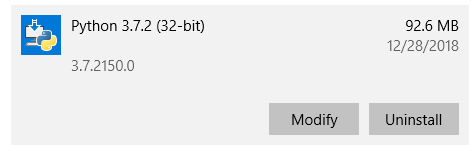

# Getting Started with Vernier LabQuest® and Python

This guide shows you how to get started writing Python programs for your [Vernier LabQuest®](https://www.vernier.com/products/labquest/). The guide contains the following topics:

- [Getting Started Requirements](#getting-started-requirements)
- [Install the LabQuest Drivers](#install-the-windows-drivers) (Windows Only)
- [Install Python 3](#install-python-3)
- [Choose an IDE](#choose-an-ide)
- [Install the labquest Package](#install-the-labquest-package)
- [Confirm Installation of the labquest Package](#confirm-installation-of-the-labquest-package)
- [Download and Run an Example](#download-and-run-an-example)
- [About the Examples](#about-the-examples)
- [Notes Regarding the labquest Functions](#notes-regarding-the-labquest-functions)
- [Troubleshooting and Notes](#troubleshooting-and-notes)

If you are new to Python you should look over all of the steps. If you are familiar with Python you might just focus on installing the labquest package and downloading the examples.

## Getting Started Requirements

We have developed a Python package called `labquest` that allows you to communicate with Vernier LabQuest devices via USB. This requires the following:

 - A Vernier [LabQuest Mini](https://www.vernier.com/product/labquest-mini/), [LabQuest Stream](https://www.vernier.com/product/labquest-stream/), [LabQuest 3](https://www.vernier.com/product/labquest-3/), [LabQuest 2](https://www.vernier.com/product/labquest-2/), or [LabQuest Original](https://www.vernier.com/downloads/original-labquest-updates/)
- One or more [Labquest supported sensors](https://www.vernier.com/product-category/?category=&term_product_family=labquest&page_num=1)
- A Windows® 10 or  macOS® computer
- An installation of the LabQuest driver (Windows only)
- An installation of Python 3
- An installation of the Vernier labquest package for Python 3

## Install the Windows Drivers

To communicate with LabQuest devices on Windows computers a driver must be installed. If you already have Vernier Graphical Analysis or Logger Pro software installed, you have the driver. If you do not have this Vernier software, the driver can be installed with either the [free trial of Graphical Analysis Pro](https://www.vernier.com/products/graphical-analysis/) or the [free demo version of Logger Pro software](https://www.vernier.com/product/logger-pro-3/).

## Install Python 3

The labquest package is designed to work with Python 3, it is not compatible with Python 2. In some cases, Python is pre-installed and shipped with your operating system. Use the following steps to check for Python 3 on your machine, and to install Python 3 if needed:

- Open your operating system's tool for executing commands (on Windows 10 this would be Command Prompt or Powershell, on a Mac this would be a Terminal window).
- Check to see if Python 3 is already installed on your machine by running the following command:
  - `python --version`
    - If the response is a version of Python 3, it is installed.
    - If there is no response from the command, it is not installed.
    - If the response is a version of Python 2, you will need to try a second command to check for Python 3. Run the following command:  
      - `python3 --version`
- If you have determined that Python 3 is not installed, follow these steps:
  - Find and install the latest installer for Mac or Windows from python.org. 
  - When installing on Windows, be sure to modify the installation to enable the "Add Python to environment variables". For more information on this, see the [Troubleshooting and Notes](#troubleshooting-and-notes) section of this guide.

## Choose an IDE

With Python installed, you need to choose an application that you will use to write and run your Python programs. You can write your programs in a simple text or code editor, or you can use an Integrated Development Environment (IDE). An IDE is a software application that provides all of the tools to write, comment, edit, debug, develop and run software programs. Python has an IDE bundled with it called IDLE that is cross-platform, and suitable for beginners. If you are new to Python and programming, we recommend that you start with this tool.

Later, you may want to research the various IDEs, learn about the different features, and give one a try. For example, Visual Studio Code is a free IDE available for Windows and Mac. There are many other choices, and you can find more information at python.org

## Install the labquest Package

Once you have Python 3 installed, you will use a tool called `pip` (a Python 3 package manager) to install the labquest package. Python automatically includes `pip`, so this tool is ready to use. Note that we will be using the **`pip3`** command, rather than just `pip`, to ensure that the Vernier files will be associated with Python 3, and not Python 2.

The `pip3` commands are executed by running them in your operating systems’ tool for executing commands (Powershell, Command Prompt, or Terminal window). There are slight differences in the required steps to install the labquest module for Windows, and macOs. Follow the steps outlined below for your platform.

Run the following command:

`pip3 install labquest`

## Confirm Installation of the labquest Package

At this point, you should have Python 3 installed and have the labquest package installed. Before moving to examples, confirm the installation of the labquest package by showing the version information. Run the following command in the terminal:

`pip3 show labquest`

Running the `pip3 show` command will provide information about the installed package, including the version number. 
Should you need to update to a newer version in the future, run the following command in the terminal:

`pip3 install labquest --upgrade`
 
## Download and Run an Example

With the labquest package installed, it is time to run an example.

- Go to the [github LabQuest examples page](https://github.com/VernierST/labquest-examples) and download the files by clicking on the “Clone or download” green button and then clicking on the “Download ZIP” button.


- Locate the zip file in your download folder and extract/unzip the downloaded folder.
- Open your IDE (Visual Studio Code or IDLE, for example).
- From your IDE’s menu, choose File>Open
- Browse to the download and open the folder called “labquest_examples”.
- Open one of the examples that matches the sensor that you are using.
- Connect your LabQuest device to your computer via USB.
- Connect your sensor to the LabQuest device.
- Turn on your LabQuest device, if needed.
- Run the Python example. (If you are using IDLE, click on “Run Module” from the Run menu.)

## About the Examples

The examples demonstrate how to collect data from LabQuest analog and digital sensors, as well as how to control the output lines of a Vernier Digital Control Unit (DCU). These examples all use the labquest package to communicate with the LabQuest device.

A typical example program to collect periodic, single point data from analog sensors, motion detector, rotary motion, and photogate counting would include the following functions:

```
lq.open()
lq.select_sensors()
lq.start()
lq.read()
lq.stop()
lq.close()
```

A simple program using these functions looks like this:

```
from labquest import LabQuest

lq = LabQuest()

lq.open()
lq.select_sensors(ch1='lq_sensor')    
lq.start(100)

for x in range(10):
    ch1_measurement = lq.read('ch1')
    if ch1_measurement == None: 
        break 
    print(ch1_measurement)

lq.stop()
lq.close()
```

LabQuest analog sensors, motion detector, rotary motion, and photogate counting will all follow this format (with slight changes to configure data collection from the correct channel and the correct sensor). 

Performing fast data collection (a packet of samples in a short time frame), and performing photogate timing will each use a different read function (this is described below).

In addition, there are examples to show how to control the output from a Digital Control Unit (DCU) connected to LabQuest’s digital channels. The DCU allows you to control small electrical devices such as servo motors, dc motors, fans, buzzers, and such.


## Notes Regarding the labquest Functions

Here is some more information about the functions:

```
from labquest import LabQuest
lq = LabQuest()
```

- To access the functions you must start the program by importing the labquest module and creating an object called `lq` (you can give this a different name if you would like) to access the `LabQuest()` class. The functions are located in the `LabQuest()` class and can now be accessed using ‘lq’ and the function’s name, such as `lq.open()`, `lq.start()`, or `lq.read()`. 

**`lq.open()`**

- `lq.open()` will open communication to your LabQuest device from your computer via USB.

- There are no arguments for this function.

- Multiple LabQuest devices can be connected as long as they are the same type (for example, you can connect two LabQuest Minis, or two LabQuest 3’s, but not a Mini and a LabQuest 3).

**`lq.select_sensors()`**

- Use this function to configure all of the sensors used in your program.

- If this function’s argument is left blank, a prompt in the terminal allows the user to configure each LabQuest channel.

- This function has parameters for all of the channels (ch1, ch2, ch3, dig1, dig2). Set each channel with a 
string value corresponding to what sensor is connected (e.g. ch1='lq_sensor')

- The string value for ch1, ch2, and ch3 can be:
  - ```'lq_sensor', 'lq_sensor_cal0', 'lq_sensor_cal1', 'lq_sensor_cal2', 'raw_voltage'```

- The string value for dig1 and dig2 can be:
  - ```‘motion’, ‘rotary_motion’, ‘rotary_motion_high_res’, ‘photogate_count’, ‘photogate_timing’, ‘dcu’, ‘dcu_pwm’```

- Here are some examples of how you would set the parameters to match your sensor configuration.

  - A LabQuest temperature sensor connected to channel 1, taking measurements in Celsius, which is the default calibration page
    - ```lq.select_sensors(ch1='lq_sensor')```
  - Two LabQuest temperature sensors, with channel 1 reading Celsius and channel 2 reading Fahrenheit (Fahrenheit is stored in the ‘cal1’ calibration page)
    - ```lq.select_sensors(ch1='lq_sensor', ch2='lq_sensor_cal1')```
  - A LabQuest dual-range force sensor connected to channel 1 and a LabQuest motion detector connected to digital 1
    - ```lq.select_sensors(ch1='lq_sensor', dig1='motion'})```
  - A non-Vernier thermistor connected to channel 1 reading the 0-5 volt signal from the sensor. This is good for non-Vernier sensors or to read the raw signal of a Vernier analog sensor.
    - ```lq.select_sensors(ch1='raw_voltage)```

**`lq.start()`**

- Start collecting data at a specified period (time between samples).
This function takes an argument to set the period in milliseconds. For example, `lq.start(1000)` to sample every 1000 milliseconds, or `lq.start(100)` to sample every 100 milliseconds.

- If this function’s argument is left blank, a prompt in the terminal will appear for the user to enter the specified period.

**`measurement = lq.read()`**

- The `lq.read()` function will return single point readings from the selected channel at the desired period.

- Use a separate `lq.read()` for each configured channel.

- The channel to read is set with this function's argument. For example, reading from ch1 and dig1
  - `ch1_measurement = lq.read('ch1')`
  - `dig1_measurement = lq.read('dig1')`

- Place the `lq.read()` function in a loop and make sure the loop can iterate fast enough to keep up with the sampling period (that is, do not have other code in the data collection loop that might slow the loop).

- Single point data collection is the best method for longer and slower acquisition from sensors. For collecting a lot of data in a very short amount of time use `lq.read_multi_pt()`

**`measurements = lq.read_multi_pt()`**

- The `lq.read_multi_pt()` function returns multi-point readings from the selected channel at the desired period.

- The channel and number of data points to collect is set with this function’s arguments. For example, reading 100 data points from ch1
  - `ch1_measurements = lq.read_multi_pt('ch1', 100)`

- Multi-point data collection is the best method to capture a lot of data in a small amount of time. Data collected over a longer time period, at a slower rate, should use `lq.read()`

**`measurements = lq.photogate_timing()`**

- When using a photogate to collect timing data, measurements are not returned with `lq.read()`, instead they are returned with the `lq.photogate_timing()` function.

- This function returns a list of measurements of the photogate’s blocked time, unblocked time, blocked time, unblocked time, etc..

- Unlike analog sensor measurements, photogate timing does not have a sampling period. Therefore, the start function’s argument should be left blank, and the user will not be prompted to enter a sampling period.
  - `lq.start()`

- The number of blocked and unblocked timing measurements to collect is set by an argument in the function. In addition, a timeout argument (seconds) is set so that the program is not waiting indefinitely for timing measurements. For example, a photogate connected to dig1, collecting 15 samples, with a 10 second timeout
  - `measurements = lq.photogate_timing('dig1', 15, 10)`

**`lq.stop()`**

- Stop data collection on the selected sensors.

- Calling the `lq.stop()` function stops data collection but does not disconnect the sensor, so it is possible to start a new round of data collection using start(), read(), and stop().

- If the program is using the Digital Control Unit (DCU), calling `lq.stop()` turns off all DCU output lines and stops any pulse width modulation (pwm) output.

- This function does take arguments that allow independent control of stopping data collection and stopping DCU output. For example, if you wanted to stop pwm output, but continue data collection, set the arguments appropriately.
  - `stop(stop_measurements=False, stop_dcu=False, stop_pwm=True)`

**`lq.close()`**

- Disconnect and close communication with the LabQuest device.
After calling `lq.close()` you can not call any other lq functions.

## Troubleshooting and Notes

### Support
- The LabQuest example programs include code that show how to run the logging module. Simply uncomment the two lines of code as explained in the examples. This will provide 'debug' and 'info' messsages in the consule as the code runs.   
- Open Graphical Analysis app and confirm your computer can connect to the LabQuest and collect sensor data.
- If you are familiar with github, you could post a question at: https://github.com/VernierST/labquest-examples/issues
- Contact us at:  support@vernier.com
 
### Python
- If you are new to Python, here are some generally helpful links for getting started with Python.
  - [Python for Beginners](https://www.python.org/about/gettingstarted/)
  - [Official Python FAQs](https://docs.python.org/3/faq/)

### Pip
- Be aware if you have Python 2 installed on your machine. This may lead to accidently using Python 2 when you install modules or run code. If you are having issues, make sure you are using the pip3 command to install into Python 3.
- For more information on installing packages in Python go to https://packaging.python.org/tutorials/installing-packages/
 
### Installing Python on Windows
- When installing on Windows, be sure to modify the installation to enable the "Add Python to environment variables" option in the "Advanced Options" part of the installer. If you missed this step, you can always modify your installation, like so:
- Go to Add or Remove programs, find Python 3 and select Modify.



- You should now be on the Optional Features screen. Ensure these are selected and click Next.


- You should now be on the Advanced Options screen. Check the “Add Python to environment variables” button, if it is not already checked. Click Install.


## License

All of the content in this repository is available under the terms of the [BSD 3-Clause License](../LICENSE).

Vernier products are designed for educational use. Our products are not designed nor are they recommended for any industrial, medical, or commercial process such as life support, patient diagnosis, control of a manufacturing process, or industrial testing of any kind.