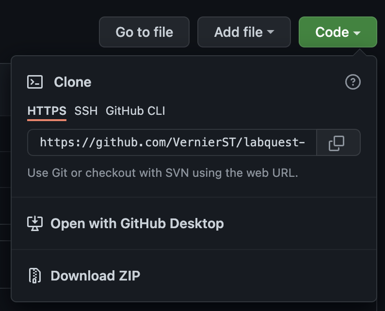
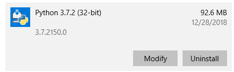
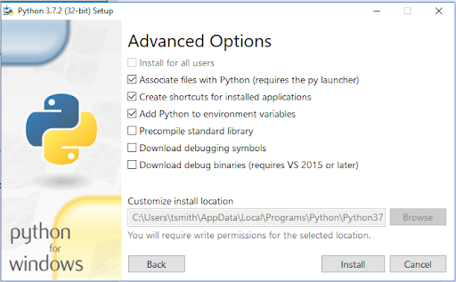

# Getting Started with Vernier LabQuest® interfaces and Python

This guide shows you how to get started writing Python programs for your [Vernier LabQuest® interfaces](https://www.vernier.com/products/labquest/). The guide contains the following topics:

- [Getting Started Requirements](#getting-started-requirements)
- [Install Python 3](#install-python-3)
- [Choose an IDE](#choose-an-ide)
- [Install the Vernier labquest Module](#install-the-vernier-labquest-module)
- [Confirm Installation of the labquest Module](#confirm-installation-of-the-labquest-module)
- [Download and Run an Example](#download-and-run-an-example)
- [Troubleshooting and Notes](#troubleshooting-and-notes)

If you are new to Python you should look over all of the steps. If you are familiar with Python you might just focus on installing the labquest module and downloading the examples.

## Getting Started Requirements

We have developed a Python module called `labquest` that allows you to communicate with Vernier LabQuest interfaces via USB. This requires the following: 

- A Vernier LabQuest interface. Any of the following will work:
  - [LabQuest Mini](https://www.vernier.com/product/labquest-mini/)
  - [LabQuest Stream](https://www.vernier.com/product/labquest-stream/)
  - [LabQuest 3](https://www.vernier.com/product/labquest-3/)
  - [LabQuest 2](https://www.vernier.com/product/labquest-2/)
  - [LabQuest](https://www.vernier.com/downloads/original-labquest-updates/)
- One or more [Labquest supported sensors](https://www.vernier.com/product-category/?category=&term_product_family=labquest&page_num=1)
- A Windows® 10, macOS® computer
- An installation of Python 3
- An installation of the Vernier labquest module for Python 3

## Install Python 3

The labquest module is designed to work with Python 3, it is not compatible with Python 2. In some cases, Python is pre-installed and shipped with your operating system. Use the following steps to check for Python 3 on your machine, and to install Python 3 if needed: 

- Open your operating system's tool for executing commands (on Windows 10 this would be Command Prompt or Powershell, on a Mac or Linux this would be a Terminal window).
- Check to see if Python 3 is already installed on your machine by running the following command:
  - `python --version`
    - If the response is a version of Python 3, it is installed.
    - If there is no response from the command, it is not installed.
    - If the response is a version of Python 2, you will need to try a second command to check for Python 3. Run the following command:  
      - `python3 --version`
- If you have determined that Python 3 is not installed, follow these steps:
  - Find and install the latest installer for Mac or Windows from python.org. 
  - When installing on Windows, be sure to modify the installation to enable the "Add Python to environment variables". For more information on this, see the [Troubleshooting and Notes](#troubleshooting-and-notes) section of this guide.

## Choose an IDE

With Python installed, you need to choose an application that you will use to write and run your Python programs. You can write your programs in a simple text or code editor, or you can use an Integrated Development Environment (IDE). An IDE is a software application that provides all of the tools to write, comment, edit, debug, develop and run software programs. Python has an IDE bundled with it called IDLE that is cross-platform, and suitable for beginners. If you are new to Python and programming, we recommend that you start with this tool.

Later, you may want to research the various IDEs, learn about the different features, and give one a try. For example, Visual Studio Code is a free IDE available for Windows and Mac. There are many other choices, and you can find more information at python.org

## Install the Vernier labquest Module

Once you have Python 3 installed, you will use a tool called `pip` (a Python 3 package manager) to install the labquest module and other Python modules that you may need. Python automatically includes `pip`, so this tool is ready to use. Note that we will be using the **`pip3`** command, rather than just `pip`, to ensure that the Vernier files will be associated with Python 3, and not Python 2.

The `pip3` commands are executed by running them in your operating systems’ tool for executing commands (Powershell, Command Prompt, or Terminal window). There are slight differences in the required steps to install the labquest module for Windows, and macOs. Follow the steps outlined below for your platform.

Run the following command in Powershell or Command Prompt (Windows), or Terminal on macOS to install the labquest module:

`pip3 install labquest`

## Confirm Installation of the labquest Module

At this point, you should have Python 3 installed and have the labquest module installed. Before moving to examples, confirm the installation of the labquest module by showing the version information. Run the following command in the terminal:

`pip3 show labquest`

Running the `pip3 show` command will provide information about the installed package, including the version number. 
Should you need to update to a newer version in the future, run the following command in the terminal:

`pip3 install labquest --upgrade`
 
## Download and Run an Example

With the labquest module installed, it is time to run an example. 
- Go to the [github labquest examples page](https://github.com/VernierST/labquest-examples) and download the files by clicking on the “Clone or download” green button and then clicking on the “Download ZIP” button.

- Locate the zip file in your download folder and extract/unzip the downloaded folder.
- Open your IDE (Visual Studio Code or IDLE, for example).
- From your IDE’s menu, choose File>Open
- Browse to the download and open the folder called “python”.
- Open one of the getting started examples (lq_analog_sensor_info.py, for example) 
- Connect your LabQuest via USB and connect you analog sensor to the LabQuest.
- Run the Python example. (If you are using IDLE, click on “Run Module” from the Run menu.)

## Troubleshooting and Notes

### Support
- Contact us at:  support@vernier.com
- If you are familiar with github, you could post a question at: https://github.com/VernierST/labquest-examples/issues
 
### Python
- If you are new to Python, here are some generally helpful links for getting started with Python.
  - [Python for Beginners](https://www.python.org/about/gettingstarted/)
  - [Official Python FAQs](https://docs.python.org/3/faq/)

### Pip
- Be aware if you have Python 2 installed on your machine. This may lead to accidently using Python 2 when you install modules or run code. If you are having issues, make sure you are using the pip3 command to install into Python 3.
- For more information on installing packages in Python go to https://packaging.python.org/tutorials/installing-packages/
 
### Installing Python on Windows
- When installing on Windows, be sure to modify the installation to enable the "Add Python to environment variables" option in the "Advanced Options" part of the installer. If you missed this step, you can always modify your installation, like so:
- Go to Add or Remove programs, find Python 3 and select Modify.

- You should now be on the Optional Features screen. Ensure these are selected and click Next.

- You should now be on the Advanced Options screen. Check the “Add Python to environment variables” button, if it is not already checked. Click Install.

- If you are using Python v3.8 and installing the bleak module, you may encounter an error like this:

`error: option --single-version-externally-managed not recognized`

This is a known incompatibility and the options to work around it are described here: https://github.com/hbldh/bleak/issues/147

## License

All of the content in this repository is available under the terms of the [BSD 3-Clause License](../LICENSE).

Vernier products are designed for educational use. Our products are not designed nor are they recommended for any industrial, medical, or commercial process such as life support, patient diagnosis, control of a manufacturing process, or industrial testing of any kind.